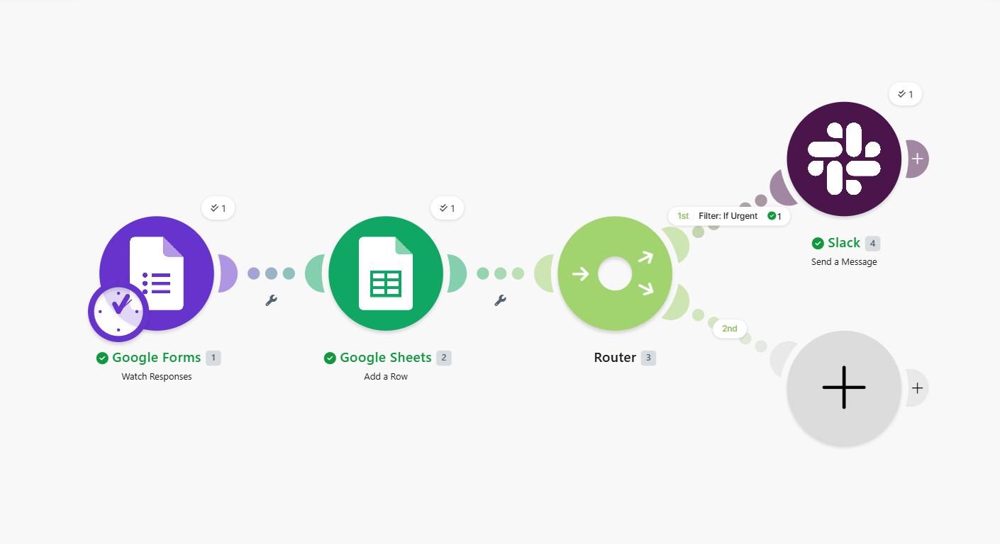
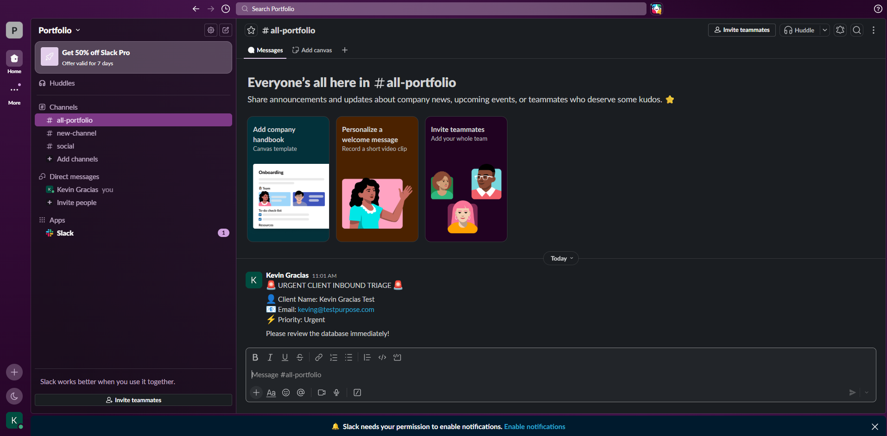

# Enterprise Automation Hub

A centralized production repository containing scalable, infrastructure-as-code automation workflows, data triage engines, and third-party API integrations. These systems are designed to eliminate manual data entry, minimize response latency for critical events, and bridge gaps between disconnected enterprise applications.

---

## 📊 Project 1: Automated Client Inbound Triage & Escalation Engine

### 🔍 System Overview

An automated pipeline that monitors inbound customer triage forms in real time. The system acts as an operational routing engine: 100% of incoming submissions are instantaneously logged to a master historical database, while high-priority ("Urgent") submissions automatically bypass standard queues to trigger an immediate, high-visibility escalation alert in internal communication channels.

```

           [ Inbound Google Form ]
                     │
                     ▼
            [ Make.com Trigger ]
                     │
                     ▼
         [ Google Sheets Database ]
                     │
                     ▼
          [ Logical Flow Router ]
          📂                  📂
(Priority == Urgent)  (Priority != Urgent)
          │                    │
          ▼                    ▼
[ Slack Escalation ]      [ Terminate ]

```

### 🛠️ Tech Stack & Architecture

| Layer | Tool | Role |
|---|---|---|
| **Ingress** | Google Forms API | Real-time submission webhook |
| **Data Warehouse** | Google Sheets REST API | Historical row logging |
| **Orchestration** | Make.com | Dynamic routing & relational filtering |
| **Notification** | Slack API | `chat.postMessage` payload execution |

### 💡 Core Problems Solved

- **Zero-Latency Escalation:** Eliminated inbound response delay by building an active listener that surfaces mission-critical tickets to engineers in under 2 seconds.
- **Data Integrity:** Fixed nested array payload parsing issues by mapping to explicit JSON primitive string keys (`textAnswers.answers[].value`), ensuring data never arrives as corrupted or unreadable blocks.
- **Resource Efficiency:** Built conditional router logic so internal team channels are protected from alert fatigue — non-urgent submissions are silently recorded in the database without notifying staff.

---

## 📁 Repository Structure

```text
enterprise-automation-hub/
├── assets/
│   ├── triage-canvas.png         # Workflow blueprint architecture diagram
│   └── slack-output.png          # Verified Slack payload execution proof
├── blueprints/
│   └── client-triage-engine.json # Portable Infrastructure-as-Code (IaC) JSON export
└── README.md                     # System documentation
```

---

## 🚀 Deployment & Replication

The workflow is packaged as Infrastructure-as-Code for easy replication in your own cloud workspace.

1. Create an inbound form with the following fields: **Full Name** (Text), **Company Email** (Text), and **Priority** (Dropdown).
2. Download the blueprint from `blueprints/client-triage-engine.json`.
3. In Make.com, click the three-dot menu (`...`) in the bottom navigation pane and select **Import Blueprint**.
4. Upload the downloaded JSON file.
5. Re-authenticate your Google and Slack workspace connections when prompted.
6. Toggle the scheduling switch to **ON**.

---

## 🎯 Verification Proof

### Pipeline Execution Architecture

The running pipeline demonstrates complete, error-free path routing across all active nodes.



### Production Notification Output

Parsed data payload executing in the production Slack environment with clean token mapping.


